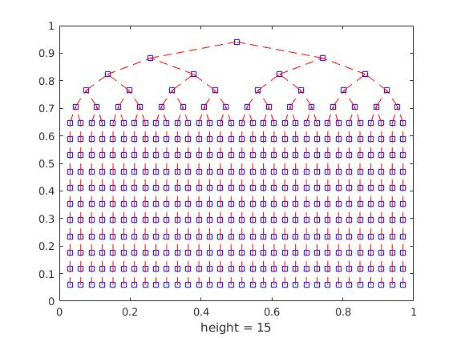
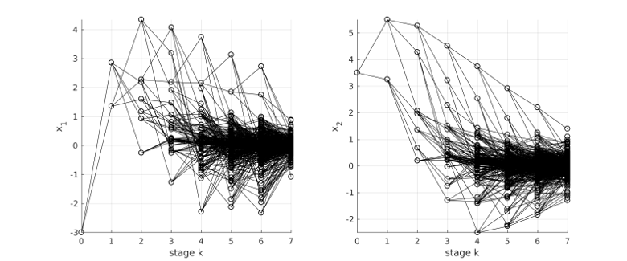
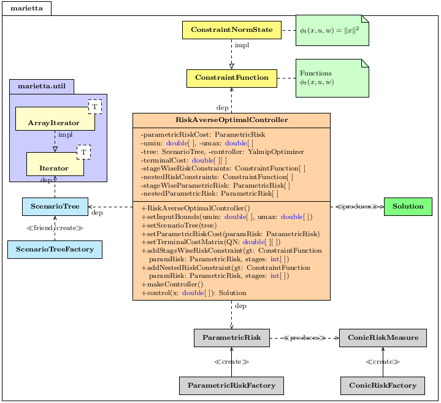

# Marietta

MATLAB toolbox for risk-averse optimization

This is still work in progress.

NOTE: Add `matlab/` to your path to be able to use this toolbox.

## Scenario trees

Scenario trees are finite-horizon representations of random processes on probability spaces with finitely many events.

Scenario trees are described by the class `marietta.ScenarioTree`.

Methods in this class allow us to access the nodes of a tree, traverse them, get their ancestor or children and much more. 

For more information type:

```matlab
doc marietta.ScenarioTree
```

Let us now see how to construct a scenario tree

### IID Process 
We may generate a scenario tree from a (stopped) IID process
 
```matlab
probDist = [0.6 0.4];      % probability distribution
ops.horizonLength = 15;    % horizon length
ops.branchingHorizon = 5;  % stopping time
tree = marietta.ScenarioTreeFactory.generateTreeFromIid(probDist, ops);
disp(tree);
plot(tree);
```

This will print

```
-----------------------------------
Scenario tree
-----------------------------------
+ Horizon....................    15
+ Number of nodes............   383
+ Number of scenarios........    32
+ Value dimension............     1
-----------------------------------
```

and will plot



### Markov Process 
or from a Markov chain with a given initial distribution and given probability transition matrix

```matlab
initialDistr = [0.2; 0.1; 0.0; 0.7];
probTransitionMatrix = [
    0.7  0.2  0.0  0.1;
    0.25 0.6  0.05 0.1;
    0.4  0.1  0.5  0.0;
    0.0  0.0  0.3  0.7];
ops.horizonLength = 4;
tree = marietta.ScenarioTreeFactory.generateTreeFromMarkovChain(...
    probTransitionMatrix, initialDistr, ops);
disp(tree);
```

This will print

```
-----------------------------------
Scenario tree
-----------------------------------
+ Horizon....................     4
+ Number of nodes............   116
+ Number of scenarios........    77
+ Value dimension............     1
-----------------------------------
```

### From Data

A tree can be constructed from available data

```matlab
options.ni = [2*ones(1,6) ones(1,10)];
tree = marietta.ScenarioTreeFactory.generateTreeFromData(data, options);
```


### Iterators: traversing the nodes

Iterators allow us to traverse certain nodes of the tree easily and efficiently, 
without having to write lots of for loops. 

This is how we can traverse all nodes of a tree at stage `k=3`

```matlab
iter = tree.getIteratorNodesAtStage(3)
while iter.hasNext
  nodeId = iter.next;
end
```

Likewise, to iterate over all non-leaf nodes, we may use the iterator
`iter = tree.getIteratorNonleafNodes`.

An iterator can be restarted using `iter.restart()`. 

For details checkout `help marietta.util.Iterator`.


## Construct risk measures

We may use `marietta.ConicRiskFactory` to construct risk measures.

For example, to create a `ConicRiskMeasure` object which corresponds to the average value-at-risk over a probability space with a given probability vector `p` at level `alpha`, use:

```matlab
avar = marietta.ConicRiskFactory.createAvar(p, alpha);
```

We may then use this object to compute the risk of a random variable `Z` using `avar.risk(Z)`.

Here is a complete example in which we compute the average value-at-risk and entropic value-at-risk of a random variable `Z` at different levels `alpha`

```matlab
n = 10; Z = exp(linspace(0,5,n))';
p = exp(-0.5*(1:n))'; xd = [];
for alpha = [0.001:0.01:0.1 0.2:0.1:0.9 0.94:0.02:1.0]
    avar = marietta.ConicRiskFactory.createAvar(p, alpha);
    evar = marietta.ConicRiskFactory.createEvar(p, alpha);
    avarZ = avar.risk(Z); evarZ = evar.risk(Z);
    xd = [xd; alpha avarZ evarZ];
end

figure;
plot(xd(:,1), xd(:,2),'-o','linewidth', 2); hold on;
plot(xd(:,1), xd(:,3),'-x','linewidth', 2);
legend('AVaR', 'EVaR'); grid on;
xlabel('alpha'); ylabel('risk')
```

This will plot:


## Parametric risk measures

Risk measures are defined relative to a probability space

Often they are parametrized with additional parameters `alpha` (e.g., the average value-at-risk and the entropic value-at-risk have such a scalar parameter).

A parametric risk measure is one which depends on the underlying distribution `p` and a parameter `alpha`

In `marietta`, parametric risks are functions which follow the template `@(p, alpha) parametricRisk`

The factory class `ParametricRiskFactory` can be used to generate such parametric risks

Here is an example of use

```matlab
p_avar = marietta.ParametricRiskFactory.createParametricAvar();

p = [0.1 0.2 0.7];             % probability vector
Z = [100 10 1];                % random variable
alpha = 0.5;                   % parameter of AVaR
risk_obj = p_avar(p, alpha);   % make risk object
risk_value = risk_obj.risk(Z); % use risk object

p_avar_05 = marietta.ParametricRiskFactory.createParametricAvarAlpha(0.5);
risk_obj_05 = p_avar_05(p);
risk_value_05 = risk_obj_05.risk(Z);
```

## Costs, constraints and dynamics

Costs, constraints and dynamics are functions of the system state, `x`, input `u` and uncertain parameter `w`, at stage `t`.

Terminal costs and constraints are functions of the terminal stage, `x_N` alone.

These are supported by:

- `marietta.functions.StageFunction` and
- `marietta.functions.TerminalFunction`

respectively.

For example, say we way to define a Markov jump affine system with 2 states, 1 input and 3 modes described by `x(t+1) = A(w(t)) x(t) + B(w(t)) u(t) + p(w(t))`, where `w(t)` takes the values `1`, `2` and `3`.

Here is an example of such a construction 

```matlab
A{1} = [1 2; 3 4];
A{2} = [3 1; 5 0];
A{3} = [1 1; 0 1];

B{1} = [1; 1];
B{2} = [0; 1];
B{3} = [1; 0];

p{1} = [3; 2];
p{2} = [3; 1];
p{3} = [1; 2];

mjas = marietta.functions.MarkovianLinearStateInputFunction(A, B, p);
```

Say now we want to construct a stage cost function of the form `ell(x,u,w) = x'*Q(w)*x + u'*R(w)*u`; here is an example

```matlab
Q{1} = eye(2); Q{2} = 10*eye(2);
R{1} = 1; R{2} = 1.3;
quad_cost = marietta.functions.MarkovianQuadStateInputFunction(Q, R);
```

## Risk-averse optimal control problems

This is a step-by-step guide to constructing and solving a risk-averse  optimal control problem.

### Problem definition
First, let us construct a scenario tree using the example file `makeRiskExample` and let us choose a risk measure from `marietta.ParametricRiskFactory`...

```matlab
alpha = 0.5; 
N = 5; 
[tree, umin, umax, QN] = makeRiskExample(N);
pAvar = marietta.ParametricRiskFactory.createParametricAvarAlpha(alpha);
```

### Risk-averse optimizers
Let us now construct a risk averse optimizer (using the Builder pattern)...

```matlab
rao = marietta.RiskAverseOptimalController();
rao.setInputBounds(umin,umax)...
    .setScenarioTree(tree)...
    .setParametricRiskCost(pAvar)...
    .setTerminalCostMatrix(QN);
rao.makeController();
```

We can now use the above controller/optimizer to solve a problem given an 
initial state `x0`...

```matlab
x0 = [-3;3.5];
solution = rao.control(x0);
```
### Visualization
We may now plot the solution using

```matlab
figure;
subplot(121); solution.plotStateCoordinate(1);
subplot(122); solution.plotStateCoordinate(2);
```

this produces...



## Documentation

In MATLAB, type

```matlab
doc marietta
```

to access the documentation of this toolbox.

## UML of marietta

