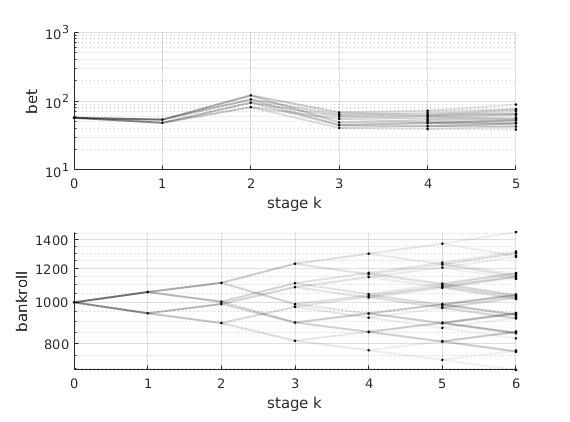
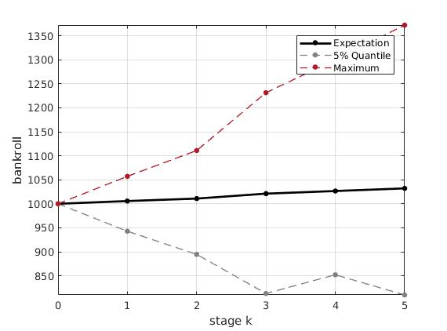

## Betting strategies with Marietta

Here is an example of how to use `marietta` to place bets. 

Suppose we have an initial bankroll `x0` and we want to place bets in a coin flip where the probability of heads is `p`. We'll take `p` to be other than `50%`.

We have a dynamical system with the state variable `x(k)` being our bankroll at time `k` and input variable `u(k)` being the amount of money we bet.

If we win we double the money we have betted.

We will use a Kelly-type cost function: we want to minimize `ell(x,u,w) = -a*log(x)`; likewise, we define the terminal cost function `ell_N(x) = -b*log(x)`.

Let us start by making a risk-averse optimal control object:

```matlab
rao = marietta.RiskAverseOptimalController();
```

Now let us define the parameters of the game

```matlab
cAlpha = 0.05;   % risk aversion against ruin
ruin = 800;      % amount that is considered to be ruin
alpha = 0.95;    % risk aversion in betting
p = 0.55;        % probability to win
N = 12;          % prediction horizon
```

Next, we construct the scenario tree which corresponds to the random process of the coin flips

```matlab
prob_dist = [p, 1-p];
tree_options.horizonLength = N;
tree_options.branchingHorizon = tree_options.horizonLength;
tree = marietta.ScenarioTreeFactory.generateTreeFromIid(prob_dist, tree_options);
disp(tree); rao.setScenarioTree(tree);
```

The system dynamics is clearly defined by `x(k+1) = x(k) + B(w(k)) u (k)`, where `B(w) = 1` if `w=1` (heads) and `B(w)=-1` if `w=2` (tails).

```matlab
A = cell(2, 1); B = cell(2, 1);
A{1} = 1; A{2} = 1; B{1} = 1; B{2} = -1;
dynamics = marietta.functions.MarkovianLinearStateInputFunction(A,B);
rao.setDynamics(dynamics);
```

We now define the cost functions

```matlab
stage_cost = -0.1*log(marietta.functions.MarkovianLinearStateInputFunction({1, 1}, {0,0}));
terminal_cost = -100*log(marietta.functions.QuadTerminalFunction([], 1));
rao.setStageCost(stage_cost).setTerminalCost(terminal_cost);
```

and the constraints 

```matlab
umin = 0; Fx = 1; Fu = -1; fmin = 0; xmin = 0;
rao.setInputBounds(umin).setStateBounds(xmin);
rao.setStateInputBounds(Fx, Fu, fmin, []);
```

To make the problem definition more interesting, we shall assume that we want to be 95% sure that our bankroll remains at all times (throughout the prediction horizon), above a critical value (which we call `ruin`)


```
stage_constraint =  marietta.functions.MarkovianLinearStateInputFunction(...
     {-1, -1}, [], {-ruin, -ruin});
pAvarConstr = marietta.ParametricRiskFactory.createParametricAvarAlpha(cAlpha);
rao.addStageWiseRiskConstraints(stage_constraint, pAvarConstr, 1:N-1);
```
 
 We now construct our risk-averse optimizer and solve the problem:
 
```
pAvar = marietta.ParametricRiskFactory.createParametricAvarAlpha(alpha);
rao.setParametricRiskCost(pAvar);
x0 = 1000;                   % initial bankroll
solution = rao.control(x0);  % determine risk-averse betting strategy
disp(solution);
```

We may now plot the solution

```matlab
figure(1);
subplot(211); solution.plotInputCoordinate(1)
h = gca; set(h,'yscale','log')
subplot(212); solution.plotStateCoordinate(1)
h = gca; set(h,'yscale','log')
```



and 

```
figure(2);
fx = marietta.functions.MarkovianLinearStateInputFunction({1, 1}, {0,0}, {0,0});
solution.plotFunctionErrorBar(fx, 0.95)
```

which produces the following figure



The black line is the expected value of the bankroll, the red line is the maximum, and the gray line is the 5%-quantile.